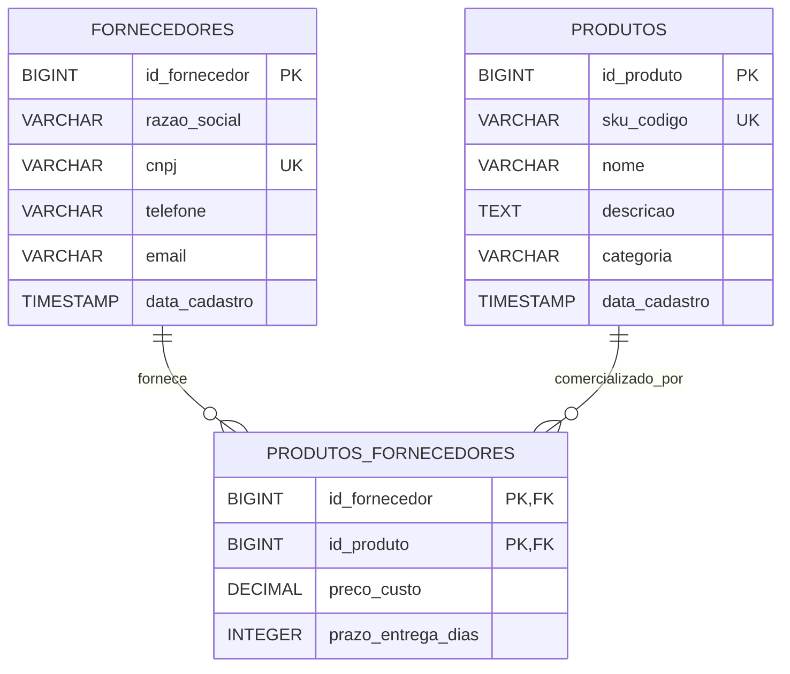

# Data Model: Gestão de Produtos e Fornecedores

**Feature**: [spec.md](file:///c:/Users/conta/Downloads/Ferreira/TesteSddComCepein/SDDcomCepein/specs/001-gestao-produtos-fornecedores/spec.md) | **Date**: 2026-08-26

## Diagrama Entidade-Relacionamento (ERD)



---

## 1. Definições de Tabelas e Schema SQL (PostgreSQL)

### Tabela `fornecedores`
Armazena os dados cadastrais das empresas fornecedoras.

```sql
CREATE TABLE fornecedores (
    id_fornecedor BIGSERIAL PRIMARY KEY,
    razao_social VARCHAR(255) NOT NULL,
    cnpj VARCHAR(18) NOT NULL UNIQUE,
    telefone VARCHAR(20),
    email VARCHAR(255) NOT NULL,
    data_cadastro TIMESTAMP NOT NULL DEFAULT CURRENT_TIMESTAMP
);

CREATE INDEX idx_fornecedores_cnpj ON fornecedores(cnpj);
CREATE INDEX idx_fornecedores_razao_social ON fornecedores(razao_social);
```

### Tabela `produtos`
Armazena os dados dos produtos do catálogo.

```sql
CREATE TABLE produtos (
    id_produto BIGSERIAL PRIMARY KEY,
    sku_codigo VARCHAR(50) NOT NULL UNIQUE,
    nome VARCHAR(255) NOT NULL,
    descricao TEXT,
    categoria VARCHAR(100),
    data_cadastro TIMESTAMP NOT NULL DEFAULT CURRENT_TIMESTAMP
);

CREATE INDEX idx_produtos_sku ON produtos(sku_codigo);
CREATE INDEX idx_produtos_nome ON produtos(nome);
```

### Tabela Associativa `produtos_fornecedores`
Representa o relacionamento N:N e armazena os atributos específicos de custo e prazo.

```sql
CREATE TABLE produtos_fornecedores (
    id_fornecedor BIGINT NOT NULL,
    id_produto BIGINT NOT NULL,
    preco_custo DECIMAL(12, 2) NOT NULL CHECK (preco_custo > 0),
    prazo_entrega_dias INT NOT NULL CHECK (prazo_entrega_dias >= 0),
    PRIMARY KEY (id_fornecedor, id_produto),
    CONSTRAINT fk_pf_fornecedor FOREIGN KEY (id_fornecedor) REFERENCES fornecedores(id_fornecedor) ON DELETE CASCADE,
    CONSTRAINT fk_pf_produto FOREIGN KEY (id_produto) REFERENCES produtos(id_produto) ON DELETE CASCADE
);
```

---

## 2. Estrutura de Entidades JPA (Java 21 / Spring Boot)

### Class `ProdutoFornecedorId` (`@Embeddable`)
```java
@Embeddable
public class ProdutoFornecedorId implements Serializable {
    private Long idFornecedor;
    private Long idProduto;
    // Equals & HashCode obrigatórios
}
```

### Entity `ProdutoFornecedor` (`@Entity`)
```java
@Entity
@Table(name = "produtos_fornecedores")
public class ProdutoFornecedor {
    @EmbeddedId
    private ProdutoFornecedorId id;

    @ManyToOne(fetch = FetchType.LAZY)
    @MapsId("idFornecedor")
    @JoinColumn(name = "id_fornecedor")
    private Fornecedor fornecedor;

    @ManyToOne(fetch = FetchType.LAZY)
    @MapsId("idProduto")
    @JoinColumn(name = "id_produto")
    private Produto produto;

    @Column(name = "preco_custo", nullable = false)
    private BigDecimal precoCusto;

    @Column(name = "prazo_entrega_dias", nullable = false)
    private Integer prazoEntregaDias;
}
```

---

## 3. Regras de Validação de Dados (DTOs & Bean Validation)

| Entidade | Campo | Validações (@BeanValidation) | Mensagem de Erro |
|---|---|---|---|
| Fornecedor | `razao_social` | `@NotBlank`, `@Size(max=255)` | Razão social é obrigatória |
| Fornecedor | `cnpj` | `@NotBlank`, `@Pattern` ou `@CNPJ` | CNPJ deve ter formato válido e único |
| Fornecedor | `email` | `@NotBlank`, `@Email` | E-mail corporativo inválido |
| Produto | `sku_codigo` | `@NotBlank`, `@Size(max=50)` | Código SKU é obrigatório e único |
| Produto | `nome` | `@NotBlank`, `@Size(max=255)` | Nome do produto é obrigatório |
| ProdutoFornecedor | `preco_custo` | `@NotNull`, `@DecimalMin(value = "0.01")` | Preço de custo deve ser maior que zero |
| ProdutoFornecedor | `prazo_entrega_dias` | `@NotNull`, `@Min(0)` | Prazo de entrega não pode ser negativo |
